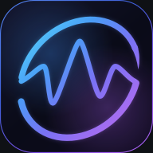

# ココロネAI for Desktop α版



**ココロネAI**（短縮名: **ココロ**）は、OllamaのローカルAIとOpenRouterの外部AIを使い分けるWindows向けAIアシスタントです。旧名称はルマAI for Desktopです。既存ブランドとの混同を避けるため改名しました。

現在は**α版**です。Web版との機能同等は未達で、不具合・未実装の機能があります。未署名の配布候補であり、正式公開・別PCでの検収・配信式自動更新はまだ完了していません。

## 対応環境

- Windows 11 x64
- 最小パッケージには.NET 10 Desktop Runtime x64とMicrosoft Edge WebView2 Runtimeが必要
- ローカルAI: Ollama本体と対応モデル
- 外部AI: 利用者自身のOpenRouter APIキーとインターネット接続

Ollama、AIモデル、APIキーは同梱しません。OpenRouterの利用料金は別途発生します。モデル導入後はOllamaでの会話をオフラインでも利用できます。検索・天気・外部歌詞・外部AIには通信が必要です。

## 現在の機能

- Ollama / OpenRouter統合モデル選択、お気に入り、対応モデルのThinking・思考レベル
- チャット、ストリーミング、停止、編集、再生成、履歴検索、プロジェクト管理
- 複数システムプロンプト、手動メモリー、会話JSONの書き出し・追加読み込み
- テキスト・対応Office/ODF/RTFの読み込み、成果物作成・対応形式の書き出し
- Web検索、天気、URL読み取り、対応モデルでの画像生成・参照画像・写真数式
- 隔離環境でのPython / JavaScript / TypeScript実行（OS操作・追加パッケージには非対応）
- 音楽再生、ローカル歌詞、無料LRCLIB標準・lyrics.ovh選択
- 専用初回セットアップ、PC診断、モデル候補表示、アプリ内モデルダウンロード
- ライト / ダーク / システムテーマ、通知領域への常駐

モデル・接続先・PC環境によって利用可否や品質は異なります。外部AIのすべての実通信は検収済みではありません。[機能の状態](docs/ALPHA_FEATURES.md)を参照してください。

## 開発中

音声/STT/TTS/通話、動画取得・字幕・音声分離、高度な調査・エージェント、OCR、完全バックアップ、署名付き自動更新、macOS/Linux対応。完成済みとしては案内しません。

## 初回起動

1. 配布パッケージを展開して`KokoroneAI.exe`を起動します。
2. α版の制限とテーマを確認し、Ollama / OpenRouter / 両方を選びます。
3. PC診断で接続・導入済みモデル・推奨候補・利用可否を確認します。
4. 必要に応じてモデルを選び、容量の確認後にダウンロードします。
5. 権限・データの扱いを確認してセットアップを完了します。

モデル取得は独立ワーカーで継続する設計です。電源断・スリープ・Ollama停止では中断することがあります。常駐中の完全終了は通知領域のメニューから行います。

## データと権限

保存先は互換性のため、旧名称の`%LOCALAPPDATA%\LumaAI-Desktop`を維持しています。改名で会話・プロンプト・設定を消しません。旧形式のDesktop履歴も読み込めます。Web版とは別管理で、勝手な移動・削除はしません。

APIキーはWindows DPAPIで保護し、確認操作まで非表示です。会話DB自体は暗号化していません。OpenRouter使用時は生成に必要な会話・選択した添付が外部へ送信されます。広告・アクセス解析・開発者への会話ログ送信は組み込みません。

[権限の説明](docs/PERMISSIONS.md) / [プライバシーポリシー](docs/PRIVACY_POLICY.md) / [利用条件](docs/TERMS.md)

## 開発・検証

Windows版はC# / .NET 10、WPF、WebView2、React / TypeScript、SQLiteで構成しています。Electronではありません。UIはDesktop専用の同梱資産で、Web版の開発サーバーは不要です。

```powershell
cd src/LumaAI.Windows/WebUi
npm ci
npm run typecheck
npm run build
cd ../../..
dotnet test tests/LumaAI.Desktop.Tests/LumaAI.Desktop.Tests.csproj -c Release
dotnet build src/LumaAI.Windows/LumaAI.Windows.csproj -c Release -o build/local
./build/local/KokoroneAI.exe
```

最小パッケージ作成: `./scripts/Prepare-Distribution.ps1 -Minimal -Version kokorone-alpha`。内部のプロジェクト名・保存キーには互換性のため旧名称が残ります。

## 公開と問い合わせ

[GitHubリポジトリ](https://github.com/Naokuma005288/KokoroNe-AI) / [Releases](https://github.com/Naokuma005288/KokoroNe-AI/releases)。配布ファイルはまだ公開していません。公開前に[リリース確認項目](docs/RELEASE_CHECKLIST.md)と依存物のライセンスを確認します。公開リポジトリにはApache-2.0のLICENSEがあります。依存物・音源・画像の条件は別途確認し、すべてが同じ許諾だとは扱いません。

不具合報告にはOS、モデル、接続先、再現手順を添え、APIキー・会話・個人情報は含めないでください。

開発者: **くなまお**  
問い合わせ: **kunamaokunamao052867@gmail.com**

[配布用README](docs/DISTRIBUTION_README.md) / [第三者レビュー項目](docs/CLAUDE_CODE_REVIEW.md)
